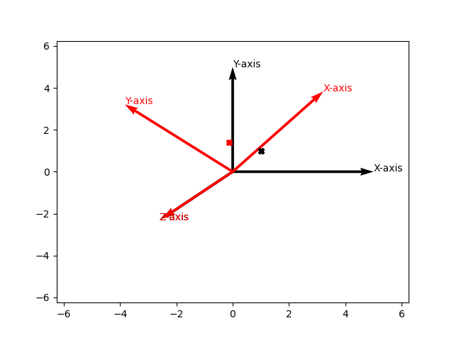

# Academics-MobileRobotics
This code provide visual representation of rotation transform, in terms of cartesian planes and plotting of the points.

OUTPUT:

code created for Academic purposes.

Copyright (c) Mohammad Arsal Asif. All rights reserved.
